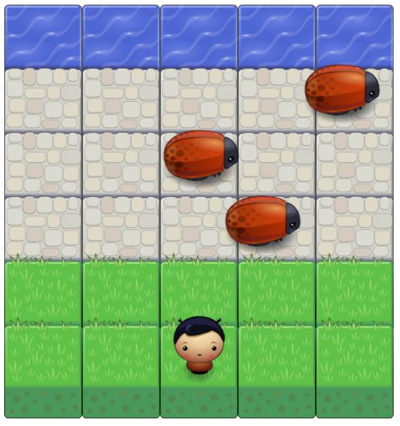

# Classical Arcade Game Clone

### About
This repository holds the files for a project of  [Udacity's Front End Developer Nanodegree](https://eu.udacity.com/course/front-end-web-developer-nanodegree--nd001). 


### How to play
The goal for the player is to cross the road and to move to the blue sea. While doing this, the player must avoid collision with the enemies,
otherwise he has to begin at the start again. The game end when the player reaches the blue sea.

### Installation

To run this game on your local machine, you can either download the files or run the git command to clone the repository:
```
git https://github.com/johannes-hoetter/Classic-Arcade-Game-Clone.git
```
Open the `index.html` file with a browser (only tested with Google Chrome and Mozilla Firefox) and enjoy the game :)

### Todos

 - Add statistics which can be seen during / after the game (e.g. number of games won without collision, time needed, rating, ...)
 - Add initial screen, where player can choose layouts (e.g. layout of map, image of player, image of enemies)
 - Add gems to the game which the player can collect (e.g. "freeze all enemies" gem)
